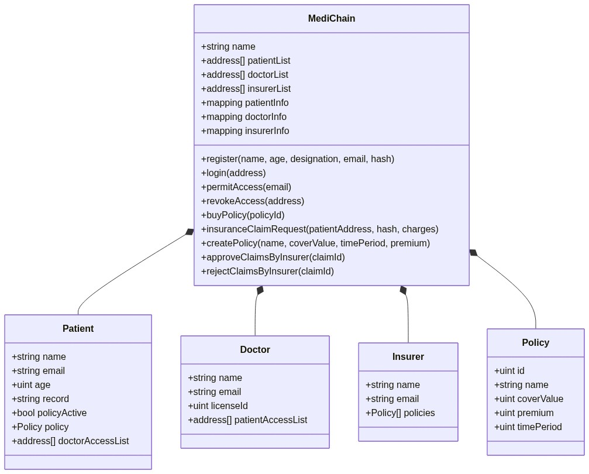
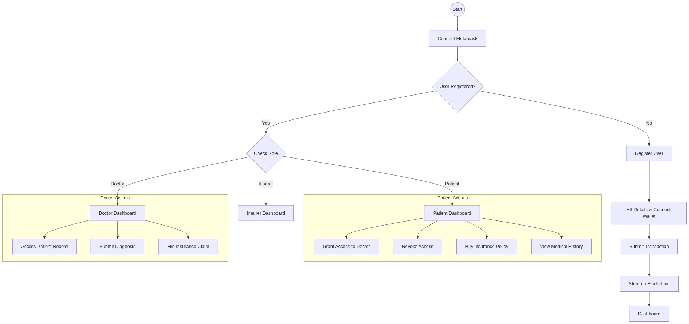

# MediChain

MediChain is a decentralized application (dApp) designed to revolutionize the management of medical records using blockchain technology. By leveraging the Ethereum blockchain and IPFS for storage, MediChain ensures that medical data is secure, immutable, and easily accessible to authorized parties such as patients, doctors, and insurers.

## Features

-   **Decentralized Record Storage**: Medical records are stored securely on IPFS, with references recorded on the Ethereum blockchain.
-   **Role-Based Access Control**:
    -   **Patients**: Have full control over their medical history and can grant access to doctors.
    -   **Doctors**: Can view patient records and add new entries upon authorization.
    -   **Insurers**: Can verify claims and view transaction histories transparently.
-   **Secure Authentication**: Uses Metamask for wallet-based authentication, ensuring secure identity management.
-   **Real-Time Currency Conversion**: Integrated with Coinbase API to display Ethereum values in INR for better usability.

## Technology Stack

-   **Frontend**: React.js, React Bootstrap
-   **Blockchain**: Ethereum (Solidity), Truffle Suite, Ganache
-   **Web3 Integration**: Web3.js
-   **Storage**: IPFS (via Infura)
-   **Styling**: Custom CSS, Bootstrap 5

## Prerequisites

Before running the project, ensure you have the following installed:

-   [Node.js](https://nodejs.org/) (v14 or higher recommended)
-   [Truffle](https://www.trufflesuite.com/truffle) (`npm install -g truffle`)
-   [Ganache](https://trufflesuite.com/ganache/) (Personal Blockchain)
-   [Metamask](https://metamask.io/) Browser Extension

## Installation and Setup

1.  **Clone the Repository**
    ```bash
    git clone <repository-url>
    cd mediChain
    ```

3.  **Install Dependencies**
    ```bash
    npm install
    npm run client:install
    npm run truffle:install
    ```

4.  **Start Ganache**
    *   Open **Ganache** and create a new workspace (or use Quickstart).
    *   Ensure Ganache is running on `127.0.0.1:7545` (default).

5.  **Deploy Contracts & Start App**
    ```bash
    npm run truffle:migrate
    npm run client:start
    ```
    This will deploy the smart contracts and launch the React application at `http://localhost:3000`.
    This will compile and deploy the `MediChain` contract to your local blockchain.

## System Model

### Class Diagram
The application architecture is centered around the `MediChain` smart contract, which manages the state and interactions between Patients, Doctors, and Insurers.



### Activity Diagram: Patient Interaction
This diagram illustrates the process of user authentication and interaction with the MediChain system.



## Running the Application

You can start the application using the provided batch script or manually.

### Option 1: Using the Batch Script (Windows)
Simply double-click `run_project.bat` in the root directory, or run it from the command line:
```bash
.\run_project.bat
```
Follow the on-screen menu to deploy contracts or start the client.

### Option 2: Manual Start
1.  **Deploy Contracts** (if not already done):
    ```bash
    cd truffle
    truffle migrate
    ```
2.  **Start the Client**:
    ```bash
    cd ../client
    npm start
    ```
3.   The application will open in your browser at `http://localhost:3000`.

## Usage

1.  **Login/Register**: Connect your Metamask wallet. The app detects your role or prompts you to register if you are a new user.
2.  **Dashboard**:
    *   **Patients**: View your records, upload new documents.
    *   **Doctors**: Access assigned patient records.
    *   **Insurers**: Validate policies and transactions.

## License

This project is licensed under the MIT License.
